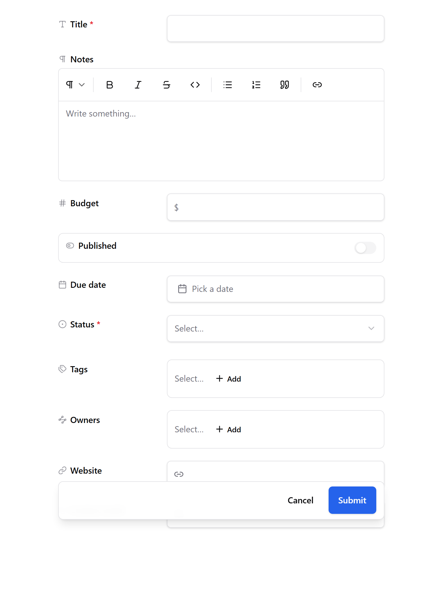

# Create a record

1. Open the model and click **New** followed by the model's name (for example **New Project**). On a phone, tap the **+** button.
2. Fill in the form. Each field has an input suited to its type: a date picker for dates, a list for choices, a search box for links to other records, an upload area for files.
3. Click **Save**.

The title is the only field that's always required. Formula fields are filled in for you, calculated from the record's other fields.

Next: [Edit or delete a record](edit-or-delete-a-record.md)
